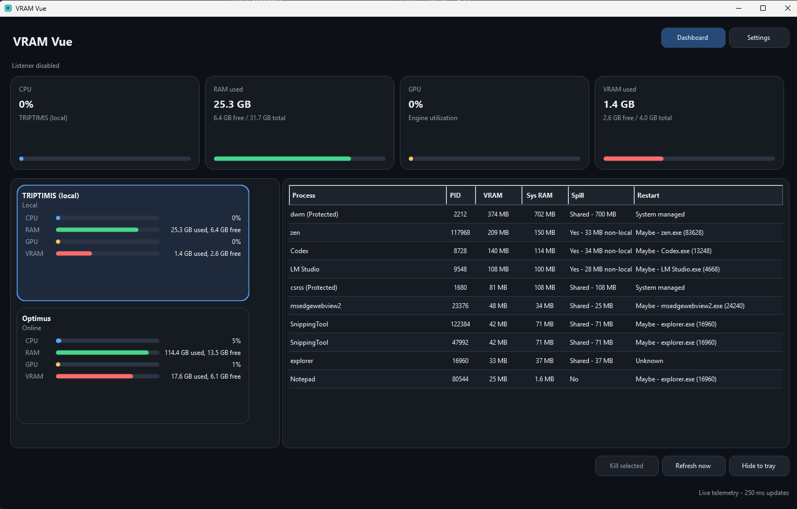
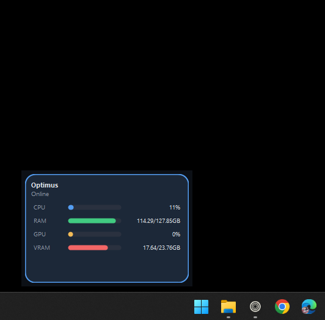
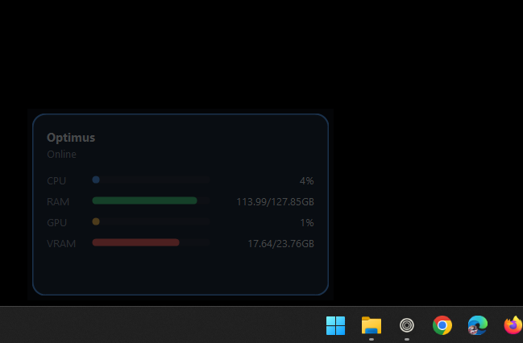

# VRAM Vue - Windows GPU VRAM Monitor for Local and Remote PCs

VRAM Vue is a dark-mode Windows desktop dashboard for watching GPU memory pressure across one or more PCs. It shows CPU, RAM, GPU utilization, physical VRAM usage, network activity, system/shared GPU memory spillover, and the top GPU-memory processes so you can free VRAM before loading local AI and LLM models.

Keywords: Windows VRAM monitor, GPU memory monitor, remote GPU telemetry, network activity monitor, LLM VRAM dashboard, NVIDIA VRAM monitor, AMD VRAM monitor, Intel GPU memory, task killer for GPU processes, multi-PC hardware dashboard.

Author/contact: Martin / `martin0641@gmail.com`

## Highlights

- Real-time CPU, RAM, GPU, and VRAM dashboard for local and remote Windows PCs.
- Up to four tracked network interfaces with receive/send bars and selectable decimal or binary bit/byte rate units.
- Rolling resource averages with a configurable window from 1 minute through 72 hours.
- Top 10 GPU-memory process list with process, parent-process, and service controls.
- VRAM-focused process columns for local VRAM, system GPU RAM, and spillover status.
- Detached borderless host monitor widgets with opacity, stay-on-top, drag-anywhere movement, edge resizing, a corner resize grip, and compact `used/totalGB` memory labels.
- TLS 1.3 HTTPS listener with basic auth and certificate pinning for remote telemetry.
- Clickable remote-host pills, configurable theme color swatches, and AES-256-GCM encrypted settings import/export.
- Self-contained win-x64 MSI installer, no separate .NET Desktop Runtime install required.
- Automatic GitHub Releases update checks with MSI upgrade handoff.
- Tray icon behavior for long-running monitoring without Remote Desktop overhead.

## Screenshots



<p>
  
  
</p>

## Download or Build Distribution Artifacts

Tagged releases publish installer assets to the GitHub Releases page. For v6, download either the MSI or the portable zip:

- [VRAM Vue releases](https://github.com/martin0641/vram-op/releases)

The v6 installer built by this repo is:

```text
dist\VRAMVue-Setup-v6.0.6-win-x64.msi
```

For users who want to unzip and run `VramVue.exe` directly, use the portable self-contained build:

```text
dist\VRAMVue-Portable-v6.0.6-win-x64.zip
```

The GitHub release notes include SHA-256 hashes for the actual downloadable files.

To rebuild both artifacts from source:

```powershell
dotnet tool install --global wix --version 6.0.2
.\scripts\Build-Msi.ps1 -Version 6.0.6
```

The MSI installs a self-contained `VramVue.exe` under Program Files and adds a Start Menu shortcut. The portable zip contains the same self-contained executable.

## Install, Upgrade, and Uninstall

```powershell
msiexec /i .\dist\VRAMVue-Setup-v6.0.6-win-x64.msi
```

The graphical installer includes a folder picker. Silent installs can set the same location with `INSTALLFOLDER`:

```powershell
msiexec /i .\dist\VRAMVue-Setup-v6.0.6-win-x64.msi INSTALLFOLDER="D:\Apps\VRAM Vue\" /qn /norestart
```

Upgrade from an older MSI:

```powershell
msiexec /i .\dist\VRAMVue-Setup-v6.0.6-win-x64.msi
```

Silent install:

```powershell
msiexec /i .\dist\VRAMVue-Setup-v6.0.6-win-x64.msi /qn /norestart
```

Uninstall:

```powershell
msiexec /x .\dist\VRAMVue-Setup-v6.0.6-win-x64.msi
```

MSI upgrades remove the previous installed version and keep the existing install folder when possible. Uninstall removes the installed executable, Start Menu shortcut, installer registry entries, and empty install directory. Per-user settings are intentionally left in `%APPDATA%\VramOp` so upgrades and reinstalls keep saved hosts and preferences.

VRAM Vue checks GitHub Releases automatically at startup, no more than once every 6 hours. When a newer release is available, it downloads the MSI, starts the installer upgrade, and closes the app so Windows Installer can replace files cleanly. You can also use the tray icon menu's **Check for updates** command.

## Build from Source

```powershell
dotnet build C:\git\vram-op\VramOp.csproj -c Release
```

The framework-dependent developer build executable is written to:

```text
C:\git\vram-op\bin\Release\net8.0-windows\VramVue.exe
```

Do not distribute the developer build folder unless the target PC already has compatible .NET 8 runtimes installed. For distribution, use the MSI or portable zip because both publish a self-contained win-x64 executable first.

## Multi-PC Setup

1. Install or run VRAM Vue on each computer you want to monitor.
2. Open **Settings**.
3. Enable the local telemetry listener, choose a port, and set a username/password.
4. On your dashboard computer, add each remote host with host/IP, port, username, and password.
5. Allow the listener port through Windows Firewall if another computer cannot connect.
6. The first successful remote connection pins that host certificate fingerprint.

The update interval defaults to `250 ms` and accepts values from `250 ms` through `9999 ms`. CPU and GPU utilization are sampled every `250 ms` and shown as a rolling 1-second average for smoother bars. Visual bar smoothing accepts `0 ms` through `6000 ms`.

Network activity can auto-detect active interfaces or track up to four manually ordered NIC slots. Receive traffic fills each NIC bar from the left; send traffic fills from the right. Rate units can be shown as `Mbps`, `MBps`, `Gbps`, `GBps`, `Mibps`, `MiBps`, `Gibps`, or `GiBps`. The main resource cards also show a rolling average window, defaulting to 5 minutes and configurable up to 72 hours.

## Detached Monitor Widgets

Double-click or right-click a host card to open a detached monitor widget for that PC.

- Borderless window.
- Drag by click-holding anywhere in the widget.
- Resize from the edges.
- Right-click and choose **Close**, or press `Esc`.
- Configure opacity and stay-on-top behavior in **Settings > Monitor popouts**.

## Troubleshooting Direct EXE Launches

If `VramVue.exe` does not open when copied from `bin\Release\net8.0-windows`, check the Windows Application log for `.NET Runtime` errors.

The developer build requires these shared frameworks on the target PC:

- `Microsoft.NETCore.App 8.x`
- `Microsoft.WindowsDesktop.App 8.x`
- `Microsoft.AspNetCore.App 8.x`

If any are missing or corrupt, use the MSI or portable zip instead. The v6 distribution artifacts are self-contained and do not rely on the machine's installed .NET runtime.

Example runtime check:

```powershell
dotnet --list-runtimes
```

## Security Model

- The listener uses an in-process HTTPS server and requires TLS 1.3.
- Each machine creates and reuses a local self-signed certificate stored in the current user's Windows certificate store.
- New certificates are persisted as non-exportable current-user keys.
- Remote clients pin the server certificate SHA-256 hash after the first successful connection. If the certificate changes later, the connection is rejected until the pin is cleared in Settings.
- Basic auth credentials are protected at rest with Windows user-scoped DPAPI in `%APPDATA%\VramOp\settings.json`.
- Settings exports are password-encrypted with PBKDF2-SHA256 and AES-256-GCM before credentials leave DPAPI storage.
- The listener exposes task-kill and service-control actions to authenticated clients, so use a strong password and only expose the port on trusted networks.

See [SECURITY.md](SECURITY.md) and [docs/SECURITY-CHECK-v6.md](docs/SECURITY-CHECK-v6.md) for the v6 security check.

## Notes

- `VRAM` is local GPU memory. `Sys RAM` is GPU-reported shared/non-local system memory for that process.
- `Spill` reports when Windows shows non-local GPU memory usage; `Shared` means the process is using shared system RAM through the GPU path.
- Summary cards show used memory first, then free or over-physical memory and detected total.
- The summary uses `GPU Adapter Memory(*)\Dedicated Usage` for adapter-level VRAM used and DXGI dedicated video memory for detected physical total, falling back to WMI only when needed.
- GPU utilization is sampled from `GPU Engine(*)\Utilization Percentage` counters and keeps counters warm between refreshes to avoid first-sample zeroes.
- The per-process `Dedicated ctr` value is kept for diagnostics, but Windows can over-report it badly for some processes. Treat it as advisory, especially for `dwm.exe` and `csrss.exe`.
- The app uses Windows performance counters, so it is not tied to NVIDIA, AMD, or Intel command line tools.
- Some elevated or protected Windows processes are shown but not killable from the app.
- Closing or minimizing the main window hides it to the tray. Use the tray icon menu to show or exit.

## GitHub Metadata

Suggested repository description:

```text
Windows VRAM and GPU memory monitor for local AI/LLM workloads, with remote multi-PC telemetry and process controls.
```

Suggested GitHub topics:

```text
windows, gpu, vram, gpu-memory, llm, local-ai, winforms, telemetry, nvidia, amd, intel-gpu, task-manager
```

## License

MIT. See [LICENSE](LICENSE).
